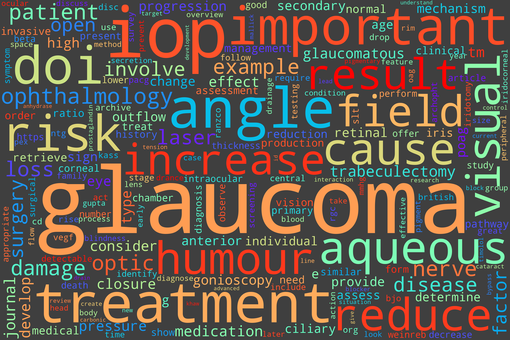

# ThesisWordcloud

## Introduction

This is a fun project, where we take a piece of text and turn it into a word cloud.

A wordcloud is a graphic way to show the frequency of words on a piece of text.


## How it works

There is a Jupter Notebook (unupdated), but this can also be run on the `main.py` file.

The documents need to be `.txt` files and located in the `/data/documents/` directory.

When running:

```shell
pipenv run python main.py
```

The wordclouds will be generated in `/data/wordclouds`.

## Example

Generated wordcloud:



Portion of essay:

> Introduction
>
>Glaucoma is no longer a single, non-significant disease. It is a serious condition that stipulates as the number one cause of preventable, irreversible blindness. Glaucoma is described as a group diseases that result in damage of the optic nerve head (ONH). This damage results in progressive peripheral visual field loss. The damage may or may not be related to raised intraocular pressure (IOP). Glaucoma can be challenging to diagnose. It sits on a continuum where the early stages of the disease are undetectable, so it is important to identify the risk factors and patients who are susceptible to development of glaucoma. Later, the disease becomes detectable but there are no symptoms and thus clinical techniques are used to look for any signs (Weinreb and Khaw, 2004). Once glaucoma is determined in a patient, it is important to identify the type of glaucoma to offer appropriate treatment.
>Mechanism of Glaucoma
>Intraocular pressure (IOP) has an important role in glaucoma. To understand its mechanism of action, it is very important to look at aqueous humor production and drainage (Kass, 2005). Aqueous humour is primarily produced by active secretion at the ciliary processes of the ciliary body, mediated by aquaporins and carbonic anhydrase; the prior requiring energy and the latter requiring enzymatic action. Fifteen percent of aqueous humour production is from ultrafiltration of blood from capillaries of the ciliary processes (Levin, 2011). Aqueous humour drains through two pathways: the majority through the conventional, and the rest through the unconventional pathway. The conventional pathway involves the iridocorneal angle, where the aqueous humour will drain through the trabecular meshwork (TM) and subsequent meshworks (uveal, corneoscleral, and juxtacanalicular). The effectiveness of drainage improves with reduced episcleral venous pressure and contraction of the ciliary muscle opening the TM. The unconventional pathway involves the uveoscleral route through the insertions of the ciliary muscles which then drain through to the lymphatic system. This route is independent to episcleral venous pressure. IOP is predicted to increase with age and to be higher during the morning. The reasoning behind this is with age results in reduced aqueous humour outflow. Being in a supine position all night also results in reduced aqueous humour outflow, giving higher IOP which would be observed in the morning (Jorge, 2010). This is important to know when monitoring IOP as factors like time of day come into play when observing an individual's IOP over time and treatment.
>
>...
